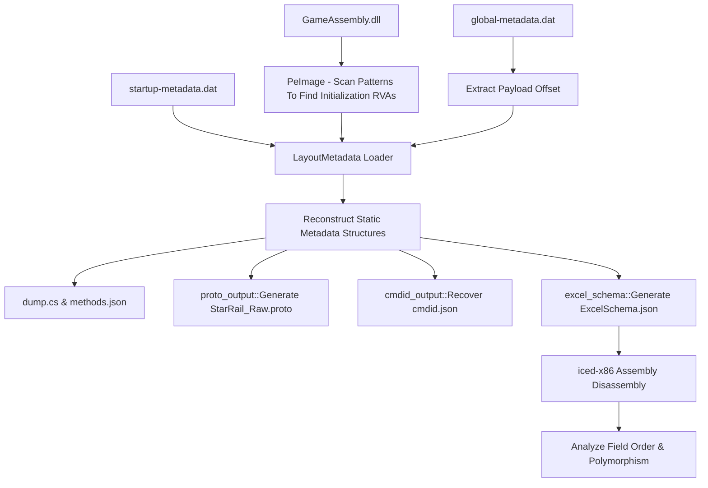

# MHY Metadata Reverse Engineering Reasoning & Workflow Guide

This document preserves the full reasoning methodology, logical architecture, mathematical decoding formulas, assembly instruction patterns, and static schema extraction workflow. Its ultimate purpose is to help future code agents and AI systems approach, understand, and easily port the tool to other HoYoverse titles with similar protection structures, such as *Zenless Zone Zero*, *Genshin Impact*, *Honkai Impact 3rd*, or newer versions of *Honkai: Star Rail*, without spending a large amount of time researching everything again from scratch.

---

## 1. Design Philosophy & Project Architecture

### 1.1. Static Dumper vs. Runtime Injection
Instead of injecting code into the running game process, which can be blocked or detected by anti-cheat software, or emulating the Unity runtime to initialize the game offline, which can crash because graphics and system dependencies are missing, this project follows an **offline static parsing** approach:
- **Read PE structures directly**: Read and analyze `GameAssembly.dll` directly from static memory through RVA (Relative Virtual Address) addresses.
- **Manually reconstruct metadata structures**: Fully decode from the raw bytes of `global-metadata.dat` and `startup-metadata.dat` using decryption keys scanned from PE code.
- **Speed and reliability**: The decoding process takes less than a few seconds and is completely independent of the operating system and the game's runtime state.

### 1.2. Data Flow



---

## 2. Decoding the `MHY\0` Metadata Format

The standard IL2CPP `global-metadata.dat` file usually starts with the magic signature `0xFAB11BAF`. However, HoYoverse games use a custom format that starts with the magic value `MHY\0` or `0x0059484D`. The entire header structure and internal data content are encrypted.

### 2.1. Locating the Static Metadata Globals Initializer
The RVA addresses of the metadata configuration registration tables (`MetadataRegistration`, `Descriptor`, `MetadataCache`, `EmbeddedHeader`) are not stored as fixed values. They are assigned dynamically in GameAssembly's static initializer function.

#### A. Search algorithm:
Scan the bytecode pattern of the static initializer function (`discover_static_metadata_globals`) in `GameAssembly.dll`. This function contains 5 consecutive pairs of `lea` and `mov` instructions that set global pointers:

```text
48 8D 05 [disp32]   ; lea rax, [rip + disp32] (MetadataRegistration)
48 89 05 [disp32]   ; mov [rip + disp32], rax
48 8D 05 [disp32]   ; lea rax, [rip + disp32] (Descriptor)
48 89 05 [disp32]   ; mov [rip + disp32], rax
48 8D 05 [disp32]   ; lea rax, [rip + disp32] (MetadataCache)
48 89 05 [disp32]   ; mov [rip + disp32], rax
...
48 8D 05 [disp32]   ; lea rax, [rip + disp32] (EmbeddedHeader)
48 89 05 [disp32]   ; mov [rip + disp32], rax
```

#### B. Validation:
After finding candidate RVAs, validate them by reading the descriptor count and method table size:
- `descriptor_count = [descriptor_rva + 0x80] + 0xE4B35170` (must be > 100,000)
- `method_span = [embedded_header_rva + 0x1F8] ^ 0x1608C2C8` (must be > 1,000,000)

### 2.2. Discovering the Payload Offset
The actual metadata data does not start at the beginning of `global-metadata.dat`; it is shifted by an offset, currently `0x208`. This shift is computed dynamically in the metadata loading function:

```text
48 8D 0D [disp32]   ; lea rcx, "global-metadata.dat"
E8 [disp32]         ; call load_file
48 89 C6            ; mov rsi, rax
48 8D 0D [disp32]   ; lea rcx, "startup-metadata.dat"
E8 [disp32]         ; call load_file
...
48 81 C6 [imm32]    ; add rsi, imm32  <-- This is the Payload Offset
```

### 2.3. Metadata String Decryption
MHY encrypts strings, such as class names, method names, and namespaces, by XORing each qword (8 bytes) with a progressive seed based on the string's position in the file.

#### A. String index decompression:
Each string is referenced by a 32-bit `index`. The data shape of the index determines the real string length and offset:
- **If `index` has a negative value (`signed_index < 0`)**:
  - `length = (index >> 23) & 0xFF`
  - `string_offset = index & 0x007F_FFFF`
- **If `index` has a positive value (`signed_index >= 0`)**:
  - `length = (index >> 25) & 0x3F`
  - `string_offset = index & 0x01FF_FFFF`

#### B. Qword XOR decryption algorithm:
The string start address is computed as: `payload_offset + global_string_data_offset + string_offset`.
The string is decrypted in 8-byte blocks (qwords):

$$\text{Initial Seed} = 0x75B679DAF67C3F24 + (0x907C49622D94D21A \times \text{string\_offset})$$
$$\text{For each qword } i: \text{DecryptedQword} = \text{EncryptedQword} \oplus \text{Seed}$$
$$\text{Update Seed for the next qword}: \text{Seed} = \text{Seed} + 0x3E693CD23A41FDEF$$

---

## 3. Index Decoding Formulas & Table Decryption Keys

Each entity in the metadata (Method, Field, Parameter, Generic, and so on) is stored in a contiguous table. To access the correct information, each entity attribute must be XORed with a hash-key function that depends on the entity's real index in the table.

Below are the mathematical decoding formulas recovered by reverse engineering getter functions in `GameAssembly.dll`:

### 3.1. Method Key
Used to decode method names, parameter starts, return types, and attribute flags:

$$\text{value} = \lfloor \frac{((index \times 0x31E1) \oplus 0x33914937) \times 0x2C03F17D}{2^{23}} \rfloor \times 0x540CC9F4 \div 2^{21}$$
$$\text{method\_key}(index) = \text{value} + 0x71BC7861$$

- **Method Name Index**: `(raw_name_index ^ method_key) ^ 0x0E714BC1`
- **Method Parameter Start**: `(raw_param_start ^ method_key) ^ 0x009889B8`
- **Method Return Type Index**: `(raw_return_type + 0x9AC1F4E3) ^ method_key`
- **Method Parameter Count**: `raw_param_count ^ (method_key & 0xFF) ^ 0xA8`

### 3.2. Parameter Key
Used to decode the type of each parameter:

$$\text{value} = \lfloor \frac{(index \times 0x72E1D74B12B) + 0x1911D05AFF5}{2^{11}} \rfloor$$
$$\text{parameter\_key}(index) = (\text{value} \times 0x58B870A2) + 0x83CF7B44$$
$$\text{Parameter Type Index} = (\text{raw\_type\_index} \oplus 0x67E90DC5) - \text{parameter\_key}(index)$$

### 3.3. Field Key
Used to decode field names and field types:

$$\text{field\_key}(\text{raw\_field\_start}, \text{local\_index}) = 0xAD416BB9 - (\text{raw\_field\_start} \times 0x2C5DCB00) + (\text{local\_index} \times 0xD3A23500)$$
- **Field Name Index**: `raw_name_index + field_key + 0x2AAFC785`
- **Field Type Index**: `raw_type_index + field_key`

### 3.4. Property Key
Used to decode property names, getter/setter local indexes, and flags:

$$\text{v1} = (index \times 0x1793) \oplus 0x280E7A20$$
$$\text{v2} = \lfloor \frac{\text{v1} \times 0x6D28A1EF}{2^{17}} \rfloor \oplus 0x727EFF5B$$
$$\text{property\_key}(index) = (\text{v2} + 0x633C43D6) \oplus 0x4ADBD505$$

### 3.5. Generic Parameter Key
Used to decode names of original generic type parameters, such as `T`, `TKey`, and `TValue`:

$$\text{v1} = \lfloor \frac{0x09DC5DB71F0EB440 + (0x617FE3CC452C \times index)}{2^{9}} \rfloor + 0x2AD8C631 \oplus 0x5278374D$$
$$\text{generic\_parameter\_key}(index) = \lfloor \frac{\text{v1} \times 0x4AADBD4B}{2^{15}} \rfloor$$
- **Name Index**: `raw_name_index - generic_parameter_key + 0xBB777EDD`

### 3.6. Generic Container Key
Used to determine the number of generic arguments for a class or method:

$$\text{v1} = \lfloor \frac{0x0A64CAD60FA052C0 + (0x3D6913E0AF40 \times index)}{2^{23}} \rfloor \times 0x770E3FE8$$
$$\text{v2} = \lfloor \frac{\text{v1}}{2^{11}} \rfloor \times 0x2C9A0EA3$$
$$\text{generic\_container\_key}(index) = \lfloor \frac{\text{v2}}{2^{23}} \rfloor$$

### 3.7. Metadata Usage Key
Used to map static indexes in x64 machine code to real metadata structures:

$$\text{v1} = \lfloor \frac{((index \times 0x87C3) \oplus 0x5FA3FAD3) \times 0x334FB2BA + 0x0454D10D89E6A02A}{2^{14}} \rfloor$$
$$\text{v2} = \text{v1} \times 0x102533D7 + 0x0058972D9863A807$$
$$\text{metadata\_usage\_key}(index) = \lfloor \frac{\text{v2}}{2^{23}} \rfloor$$

#### 3.7.1. Mapping Metadata Usage Pairs To Runtime Slots
After decoding an entry in the metadata usage pair table, split it as follows:

- `destination_index = (raw_destination ^ 0x6907AB9A) - metadata_usage_key(index)`
- `encoded_source = raw_source - metadata_usage_key(index) + 0xAB3A6CB5`
- `kind = encoded_source >> 29`
- `source_index = encoded_source & 0x1FFF_FFFF`

`kind` selects the runtime slot table:

- `1`: TypeInfo usage table
- `3`: MethodInfo usage table
- `5`: String literal usage table
- `6`: MethodInfo usage table, but the source is interpreted as metadata usage type/generic

The slot RVA is computed as:

```text
slot_rva = table_rva + destination_index * 8
```

**Important rule:** the multiplication and addition above must use checked arithmetic, not wrapping arithmetic. If `destination_index * 8` overflows `u32`, that entry cannot be a valid slot and must be skipped. When multiple usage pairs point to the same slot, keep the first valid mapping (`or_insert`) instead of allowing a later entry to overwrite it.

### 3.8. Method Attributes XOR Key Discovery
Method modifier flags, such as `public`, `private`, `static`, and `virtual`, are encrypted in a 16-bit field at `MethodInfo + 0x2A`. This decryption key is a global constant value located in GameAssembly's constant vector.

To find this key automatically without hardcoding it, scan the following instruction pattern in GameAssembly's method table builder function:

```text
66 0F 6F 05 [disp32]   ; movdqa xmm0, [rip + disp32]
4C 89 C5               ; mov rbp, r8
4C 89 44 24 38         ; mov [rsp + 0x38], r8
```

Then take the first word at the RIP-relative target address of that instruction.

### 3.9. Il2CppType Table Structure & Pointers
In recent updates, HoYoverse merged the `Il2CppType` table structure from the compact 8-byte form back into the standard 16-byte form, equivalent to the `Legacy42` format.

- **Entry size (stride):** 16 bytes.
- **Data field:** Instead of only storing an index representing array types (`SZARRAY`) or pointers (`PTR`), the current `data` field stores an **absolute virtual address (VA)** that points directly to another entry in the `Il2CppType` table.
- **Pointer resolution mechanism:** When reading the `data` field, the first 8 bytes of an entry, if the value is greater than or equal to GameAssembly's `image_base`, the system must subtract `image_base`, subtract the `Il2CppType` table's `table_rva` from the resulting RVA to obtain `byte_offset`, and finally divide `byte_offset` by 16 to obtain the correct `type_index` that points to that type.

---

## 4. Disassembly Techniques & Static Schema Reconstruction

`ExcelSchema.json` is the storage-structure map for data tables in the game. To recover the static schema without running the game, use the `iced-x86` library to analyze and reverse engineer x64 machine code generated by the IL2CPP compiler.

### 4.1. Recovering Configuration Path Lists (`list_path`)
Each Excel table configuration has a static array that contains file paths, for example `s_PathList` containing `"Config/ExcelOutput/ActivityActiveData.json"`. These paths are initialized dynamically in the configuration class's static constructor (`.cctor`).

#### Analysis workflow:
1. Identify the Excel class's `.cctor` function.
2. Read the `.cctor` machine-code stream.
3. Find the array-size assignment instruction: `mov edx, imm32`, followed by an array allocation `call`.
4. Scan `mov reg, [rip+disp32]` instructions that point to the usage address table.
5. Decode constant strings from that address through the `static_string_literal_at_slot` function to obtain the configuration paths.

### 4.2. Analyzing Binary Field Read Order (`binary_field_order`)
At runtime, data is decoded by a binary reader function. In Star Rail this is `FromBinary`, or a fallback reader such as `void Reader(BinaryReaderLike, Class&)`. The order in which fields are read sequentially from the byte stream can be completely different from the field declaration order in the class definition.

#### Analysis workflow:
1. Identify the preferred binary reader function: find the first method named `FromBinary`, or a method whose signature takes a Reader class and a configuration Row class as arguments.
2. Disassemble the machine code of this function until an interrupt instruction (`int3`/`ud2`) or return instruction (`ret`) is encountered.
3. Record memory-access instructions that assign values or take references:
   - `mov [rcx + offset], reg` (directly writes a primitive property)
   - `lea reg, [rcx + offset]` (reference access for complex properties such as String, Struct, and Array)
4. Account for cases where the compiler optimizes negative offsets using complement arithmetic: `sub reg, -imm` is effectively equivalent to adding offset `imm`.
5. Sort fields by the order in which these `offset` values appear in the x64 machine-code stream.

### 4.3. Resolving Polymorphism (`resolved_type_indexes`)
In game configurations, a data structure may have many inherited subclasses. For example, the base class `TaskConfig` has more than 3800 subclasses such as `ShowTalkDialog`, `PlayCutscene`, and so on. When reading a binary file, the game first reads an identifying index (type index), then uses this index to instantiate the corresponding subclass.

#### Analysis workflow:
There are two forms of polymorphism setup in IL2CPP-compiled code:

#### Form A: Jump Table (Switch Table) in the Reader Function
For smaller polymorphic classes, the Reader function contains a direct switch-case structure:
1. Find the maximum-index comparison instruction: `cmp eax, imm32`.
2. Check whether there is index-shifting arithmetic (bias): `dec eax` or `sub eax, imm`. Record `index_bias`.
3. Find the `lea rcx, [rip + disp32]` instruction that points to the jump-address table.
4. Analyze the target RVAs in the jump table. Scan each target function to see which class `TypeInfo` it loads (`first_type_info_load`). Store the mapping: `index + index_bias` $\rightarrow$ `TypeName`.

#### Form B: Factory Array (Object Initialization Array) in `.cctor`
For huge polymorphic classes, such as `TaskConfig`, the compiler creates an array containing object-constructor function pointers in the Factory class's static constructor `.cctor`:
1. Analyze the `.cctor` function of the Factory class that contains the array.
2. Find the loop block that loads function-pointer addresses into the static array.
3. Disassemble each initialization function in that list to extract the corresponding `TypeInfo` loaded from the metadata usage slot.
4. Convert the usage slot address to the corresponding subclass `TypeDef` name. The index in the array is the binary type index.

---

## 5. Adaptation Playbook For Other Versions / Games

When upgrading the tool for a new game version or applying it to a completely different HoYoverse game, follow this step-by-step checklist:

### Step 1: Identify the basic metadata structure
- Open `global-metadata.dat` in a hex editor. Check whether the file starts with `MHY\0`.
- If it is `MHY\0`, the game definitely uses the custom string compression and encryption mechanism.

### Step 2: Find and update string decryption keys
- If the string decryption structure has changed, find the static string decryption function in `GameAssembly.dll`. This function usually takes an index and offset, then performs a qword XOR loop.
- Use IDA Pro or Ghidra to find the multiplication and addition constants in the string decryption loop, then update the 3 main constants:
  - `STRING_PAYLOAD_SEED_ADD` (default: `0x75B679DAF67C3F24`)
  - `STRING_PAYLOAD_SEED_MUL` (default: `0x907C49622D94D21A`)
  - `STRING_PAYLOAD_INCREMENT` (default: `0x3E693CD23A41FDEF`)

### Step 3: Validate the table keys
- Check whether hash-key functions such as `method_key`, `parameter_key`, and `field_key` have changed their constants or mathematical structure.
- The fastest method is to compare decoded names of a few basic methods, such as `System.Object.ToString` or `.ctor`, with the expected results. If the decoded names are garbage strings, update the polynomial constants in the corresponding hash functions.

### Step 4: Check the Excel configuration assembly format
- In Star Rail, configurations are located in `RPG.GameCore.Config.dll`.
- In other games, the configuration DLL has a different name. For example, in Genshin Impact it may be located in `Assembly-CSharp.dll` or other DLL fragments.
- Update the DLL-name filter in the schema initialization function so it points to the correct DLL that contains the target game's data.

### Step 5: Check and tune assembly patterns
- Run the tool and observe the debug logs.
- If it fails to find the static initializer or payload offset, the compiler has changed the instruction pattern generated as machine code.
- Use IDA Pro or Ghidra to find `il2cpp::vm::MetadataCache::Initialize()` in `GameAssembly.dll`, extract the corresponding bytecode again, and update the scan patterns.
